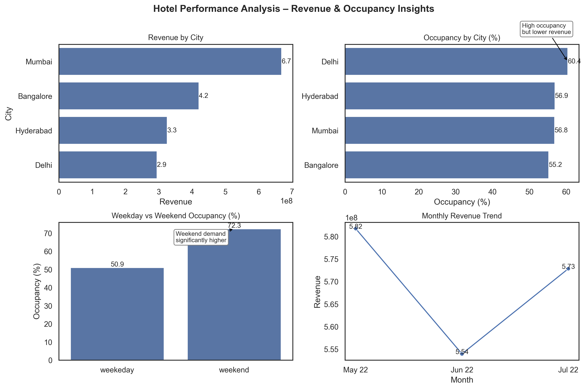

# Hotel Revenue & Occupancy Analysis (Atliq Grands Case Study)

## Problem Statement

Atliq Grands, a luxury hotel chain operating across multiple cities, has been experiencing a decline in revenue and occupancy. This project aims to analyze hotel booking data to identify key factors affecting performance and provide actionable insights to improve business outcomes.

---

## 📊 Dashboard Preview

<p align="center">
  
</p>

---

## Objective

* Analyze booking data to understand revenue trends and occupancy patterns
* Identify underperforming cities and properties
* Detect inefficiencies in pricing and platform usage
* Provide data-driven recommendations to improve performance

---

## Tools & Technologies

* Python
* Pandas
* NumPy
* Matplotlib
* Seaborn

---

## Key Analysis Performed

* Revenue analysis by city and property
* Occupancy analysis across cities and room categories
* Weekday vs weekend booking trends
* Platform-wise booking performance
* Customer ratings analysis
* Monthly revenue trends

---

## Key Insights

* Delhi shows the highest occupancy but generates comparatively lower revenue, indicating pricing inefficiencies
* Bangalore has both low occupancy and low customer ratings, suggesting service-related issues
* Weekend occupancy (~72%) is significantly higher than weekday occupancy (~50%), indicating underutilization during weekdays
* Revenue declined in June before recovering in July, suggesting seasonal demand fluctuations
* A large portion of bookings comes from aggregated platforms (“Others”), limiting visibility into platform performance

---

## Root Cause Analysis

* Uneven occupancy distribution across cities
* Pricing inefficiencies in high-demand locations
* Poor customer experience in certain properties
* Heavy reliance on unclear booking platforms
* Low weekday demand leading to lost revenue opportunities

---

## Recommendations

* Optimize pricing in high-demand cities like Delhi to improve revenue
* Improve service quality in low-performing cities such as Bangalore
* Introduce weekday offers to increase occupancy
* Focus on high-performing booking platforms and reduce dependency on unclear sources
* Promote premium room categories to maximize revenue
* Apply best practices from top-performing properties to underperforming ones
* Use seasonal strategies to handle demand fluctuations

---

## Project Structure

```
hotel-revenue-occupancy-analysis/
│
├── hotel_analysis.ipynb
├── requirements.txt
└── README.md
```

---

## Conclusion

This analysis highlights that while Atliq Grands has strong demand in certain locations, inefficiencies in pricing, uneven occupancy, and service-related issues are impacting overall performance. By addressing these areas, the company can improve both occupancy and revenue.

---
